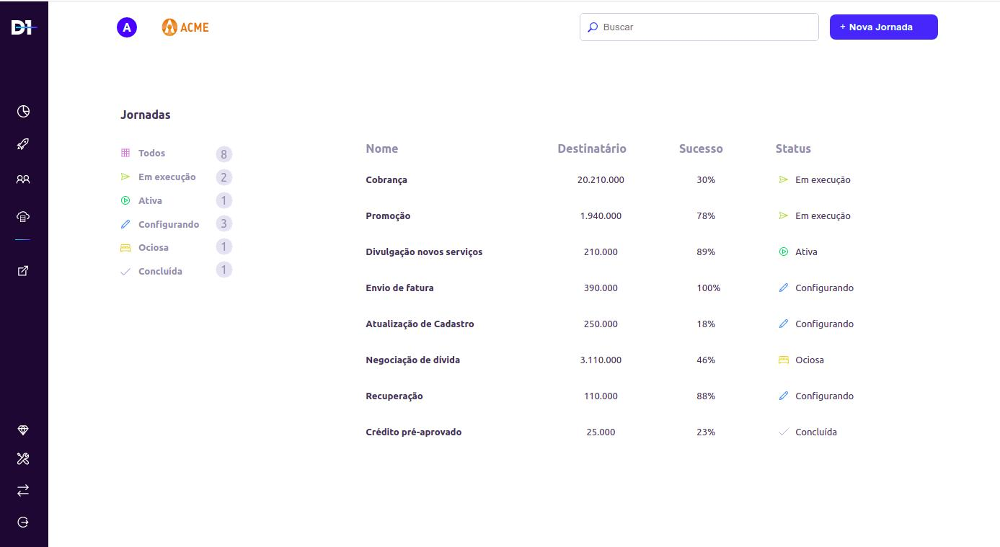

### `Sobre`

Este projeto está sendo desenvolvido como um teste para a empresa [D1](https://d1.cx/){:target="_blank" rel="noopener"} e consiste na utilização da API por eles disponibilizada. [Url API](https://api-d1-test.herokuapp.com/api/filter)

### `Instalação`

Este projeto foi inicializado com [Create React App](https://github.com/facebook/create-react-app).

🎬 Para isso, digitei no terminal: `create-react-app testeD1React`

certifique-se de ter um gerenciador de dependência / pacote instalado em seu computador:
 [link to Yarn installer](https://yarnpkg.com/getting-started/install)
[link to Npm installer](https://docs.npmjs.com/downloading-and-installing-node-js-and-npm)

⚙ Para instalar as dependências deste projeto ⚙

### `npm install` 
or 
### `npm install`

🚀 No diretório do projeto, você pode executar: 🚀

### `yarn start`
or
### `npm start`

Executa o aplicativo no modo de desenvolvimento. 
Abra [http://localhost:3000](http://localhost:3000) para vê-lo no navegador.

A página será recarregada se você fizer edições. 

Você também verá quaisquer erros de lint no console.

### `Dependencias`

### Axios
Neste projeto eu precisei usar uma ferramenta para consumir e exibir dados de uma API. Existem várias maneiras de fazer isso, mas a forma mais popular é usando axios, um cliente HTTP baseado em Promises.
saiba mais aqui [Axios](https://www.npmjs.com/package/axios)

### Styled Components
Para estilizar nossos componentes, usei uma biblioteca chamada [Styled Components](https://styled-components.com/docs/basics). 
É uma biblioteca para React e React Native que permite usar estilos de nível de componente em seu aplicativo. Eles são escritos em uma mistura de JavaScript e CSS

