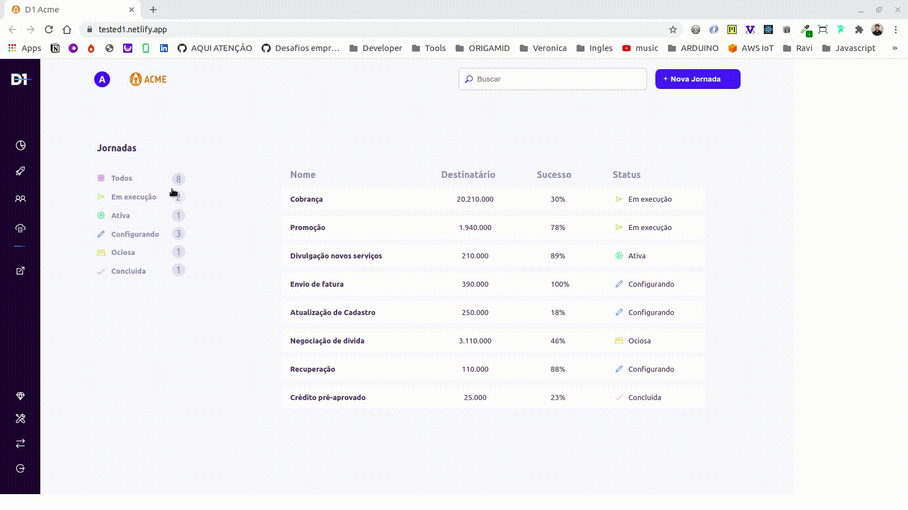

## `Sobre`

Este projeto foi desenvolvido como um teste para a empresa [D1](https://d1.cx/) e consiste na utilização da API por eles disponibilizada. [Url API](https://api-d1-test.herokuapp.com/api/filter)
O objetivo foi avaliar meu conhecimento e experiência com React e bibliotecas relacionadas para desenvolvimento front-end.

# A missão 

# 1° foi desenvolver a página abaixo:

# 2° Os dados do filtro e da tabela precisam ser consumidos da api.

## `Instalação`

Este projeto foi inicializado com [Create React App](https://github.com/facebook/create-react-app).

# 🎬 Para isso, digitei no terminal: 
`create-react-app teste_D1_React`

certifique-se de ter um gerenciador de dependência/pacote instalado em seu computador:

 [link to Yarn installer](https://yarnpkg.com/getting-started/install)  ou 
[link to Npm installer](https://docs.npmjs.com/downloading-and-installing-node-js-and-npm)

# Se quiser rodar o projeto em sua máquina local, siga os passos a seguir: 

# Clone o repositório em alguma pasta em sua máquina
$ git clone https://github.com/RafaPalau/teste_d1_react.git

# Entre no repositório
$ cd teste_d1_react

# ⚙ Para instalar as dependências deste projeto:  ⚙
No terminal rode um dos seguintes comandos.

`$ npm install` ou `$ npm install`

# 🚀 No diretório do projeto, você pode executar: 🚀

`yarn start` ou `npm start`

Executa o aplicativo no modo de desenvolvimento. 
Abra [http://localhost:3000](http://localhost:3000) para vê-lo no navegador.

A página será recarregada se você fizer edições. 

Você também verá quaisquer erros de lint no console.

### `Dependencias instaladas:`

### Axios
Neste projeto eu precisei usar uma ferramenta para consumir e exibir dados de uma API. Existem várias maneiras de fazer isso, mas a forma mais popular é usando axios, um cliente HTTP baseado em Promises.
saiba mais aqui [Axios](https://www.npmjs.com/package/axios)

### Styled Components
Para estilizar nossos componentes, usei uma biblioteca chamada [Styled Components](https://styled-components.com/docs/basics). 
É uma biblioteca para React e React Native que permite usar estilos de nível de componente em seu aplicativo. Eles são escritos em uma mistura de JavaScript e CSS

